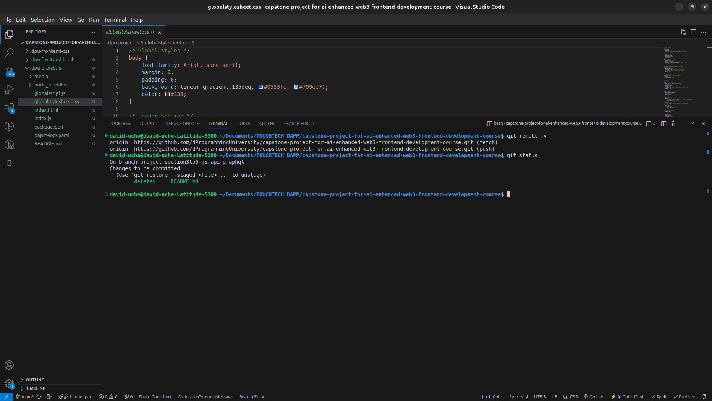
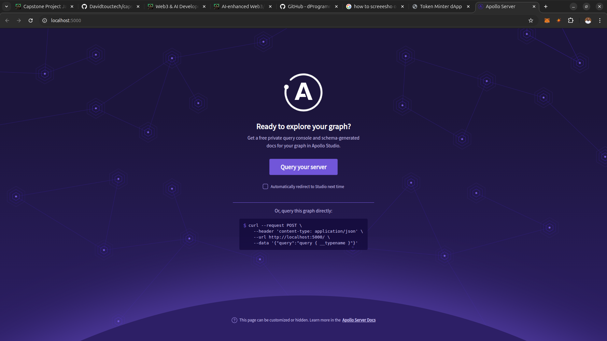
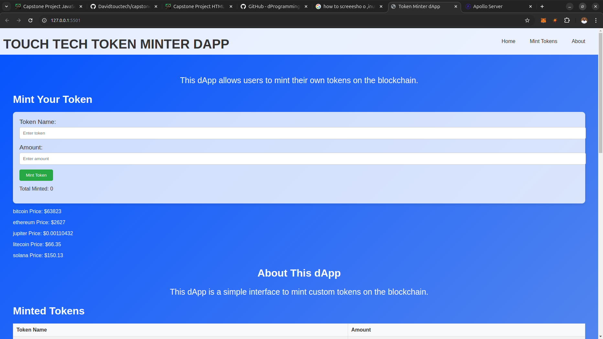

# Capstone Project For AI-enhanced Web3 Frontend Development Course
Welcome to the Capstone Project for the AI-Enhanced Web3 Frontend Development Course at dProgramming University. Follow the instructions below to complete your project submission.

# MY EXPERIENCE

# SECTION 3: 

This section was about JAVASCRIPT FOR WEB3 FRONTEND DEVELOPMENT
I was Introduced to JavaScript for Web Development

## I learnt about 
- JavaScript variables, data types, and operators
- Control flow in JavaScript – Conditionals and Loops
- Functions and scope in JavaScript
- JavaScript DOM Manipulation
- Event handling in JavaScript
- JavaScript asynchronous programming and promises
- JavaScript arrays, objects And JSON

## Challenges and How I Overcame them

I didn't experience any challenge here because the explanations from the tutor was quite clear. However I discovered that I need a crash course on JavaScript basics and I have applied for one.

# SECTION 4: 

This section was about API FOR WEB3 FRONTEND DEVELOPMENT

## I learnt about
- JavaScript APIs and fetching data

## Challenges and How I Overcame Them

It was a challenge to understand the complex terms pertaining to APIs. To solve this problem I leveraged on AI to explain codes and proffer solutions

# SECTION 5: 

This scetion was about GRAPHQL FOR WEB3 FRONTEND DEVELOPMENT
- I was introduced to GraphQL

## CHallenges and How I Overcame Them
- I had a challenge understanding the concept of GraphQL. I overcame this by using AI to explain

# SECTION 6: 

This section was about JAVASCRIPT FRAMEWORKS FOR WEB3 FRONTEND DEVELOPMENT

## I learnt about 
- JavaScript best practices and Ddbugging
- I was introduced to JavaScript Frameworks and Libraries
- I did my Capstone Project JavaScript

## Challenges and How I Overcame Them

I have some challenge getting my server to run. I solved this problem by going back to video and watching it over and over again until I saw what I was missing.

