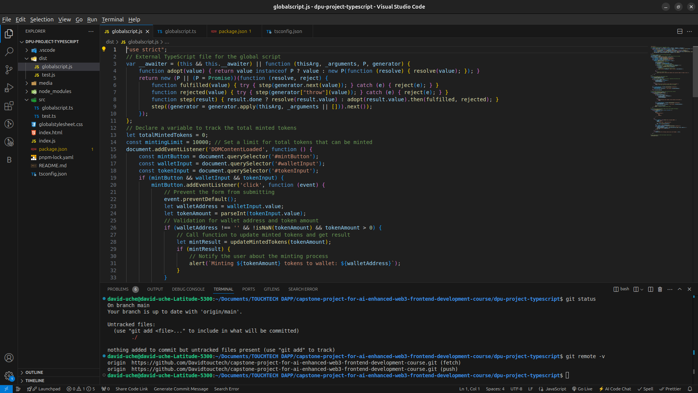
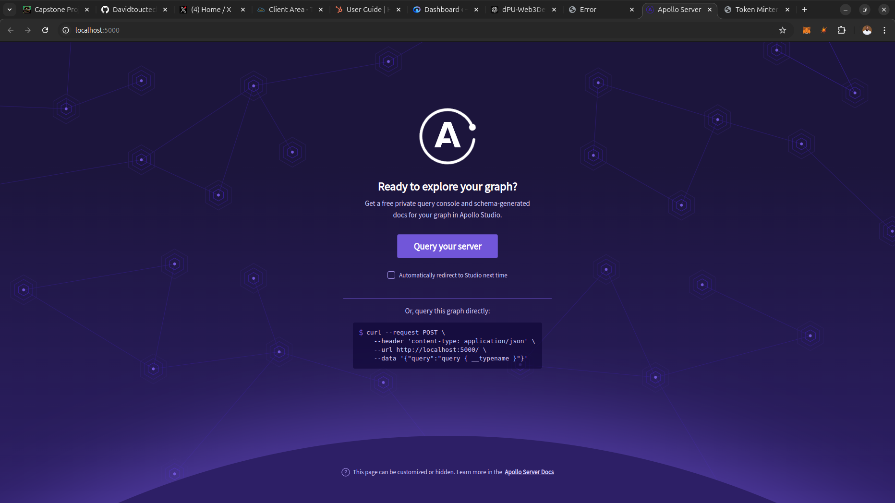

# Capstone Project For AI-enhanced Web3 Frontend Development Course
Welcome to the Capstone Project for the AI-Enhanced Web3 Frontend Development Course at dProgramming University. Follow the instructions below to complete your project submission.

# MY EXPERIENCE

This section was both fascinating and interesting. 

## What I Learnt
I learnt how to include TypeScript into my project, how to automate it incase of any changes made and how to convert my vanilla JavaScript to TypeScript.

## Challenges and How I Overcame them

I didn't experience any challenge here because the explanations from the tutor was quite clear. However I had to watch the video more than once to grasp everything that was said

